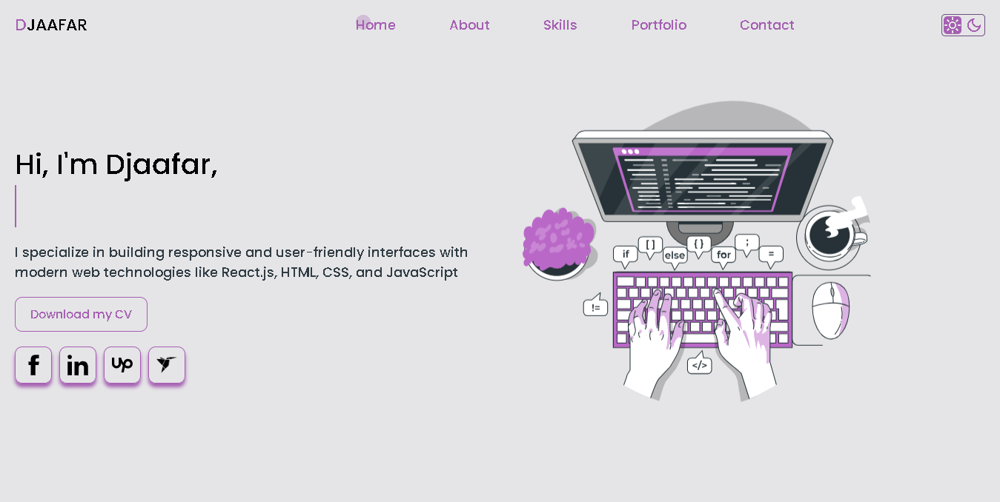
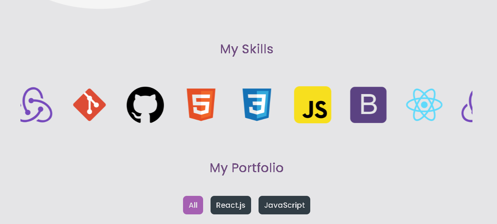
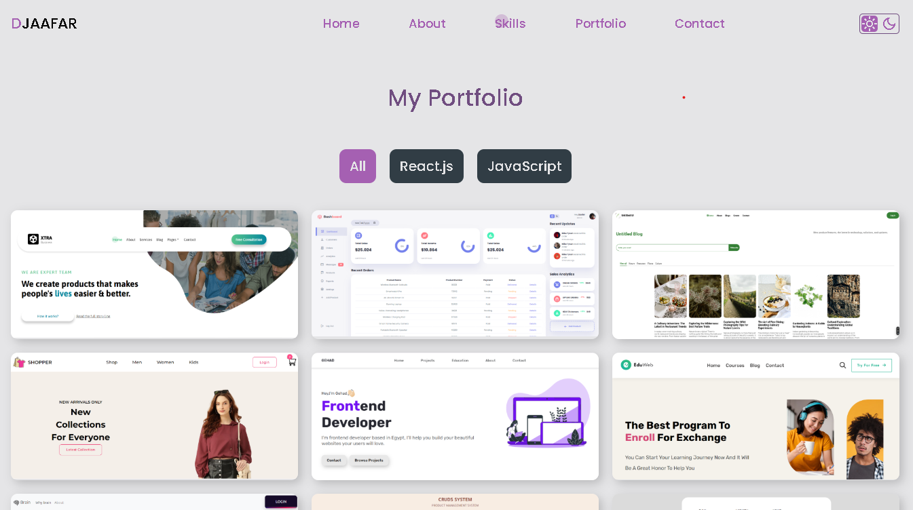

# 🌟 Portfolio Website

A sleek and responsive **Portfolio Website** built with **HTML, CSS, and JavaScript**, designed to showcase your **professional skills, projects, and contact information**. The website is **user-friendly, visually appealing, and fully optimized for all devices**.

## ✨ Sections Included
- **Home:** A captivating introduction with your name and profession.
- **About:** Details about your background, education, and experiences.
- **Skills:** A comprehensive list of your technical skills with visual indicators of proficiency.
- **Portfolio:** Showcases your projects with images, descriptions, and links.
- **Contact:** A contact form for visitors to reach out, along with social media links.

## 🚀 Features
- **Fully Responsive Design** – Seamless viewing on desktop, tablet, and mobile.
- **Smooth Scrolling Navigation** – Intuitive user experience.
- **Interactive and Dynamic Elements** – Powered by JavaScript.
- **Clean & Well-Structured Code** – Easy to customize and maintain.

## 📸 Screenshots




## 💡 Purpose
This portfolio serves as a **professional online presence** to highlight your skills and achievements, connect with clients or recruiters, and showcase your best work.

## 🔧 Installation & Usage
1. Clone the repository:
   ```bash
   git clone https://github.com/yourusername/devloper-portfolio.git
   ```
2. Navigate to the project folder:
   ```bash
   cd devloper-portfolio
   ```
3. Open `index.html` in your browser or use a live server extension.

## 🌍 Live Demo
Check out the live version here: [Portfolio Live Demo](https://lechehebdjaafar.github.io/Devloper-Portfolio/) *(Replace with actual live demo URL)*

## 📄 License
This project is licensed under the **MIT License** – feel free to modify and distribute it.

## 📩 Contact
For any inquiries, feel free to reach out:
- **LinkedIn:** [Lecheheb Djaafar](https://www.linkedin.com/in/lecheheb-djaafar-226594348/)

---

Happy Coding! 🚀

